# LITERALURA

## Descripción
Literalura es una aplicación desarrollada integramente en Java y el framework SpringBoot.
Permite a los usuarios consultar, descargar y almacenar datos de libros disponibles en Gutendex.com, la web API del Proyecto Gutenberg.
A continuación algunas capturas de pantalla de la aplicación en funcionamiento:
### Pantalla de inicio
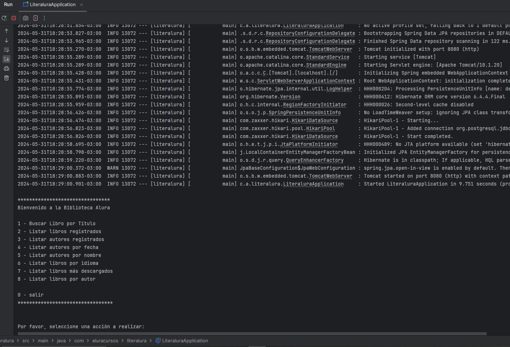
### Pantallas de la aplicación en funcionamiento
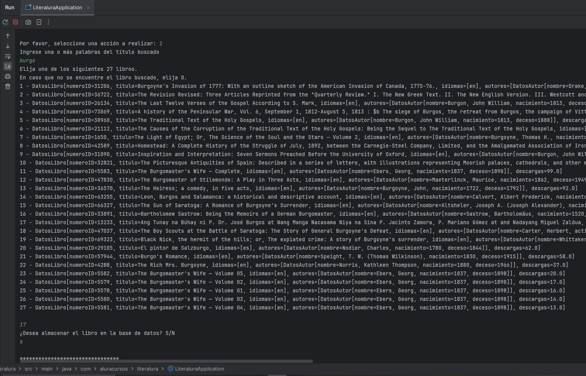
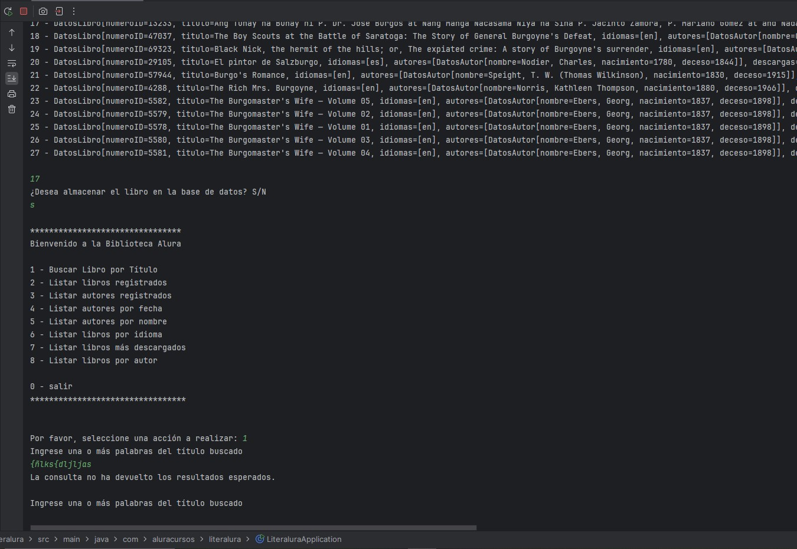
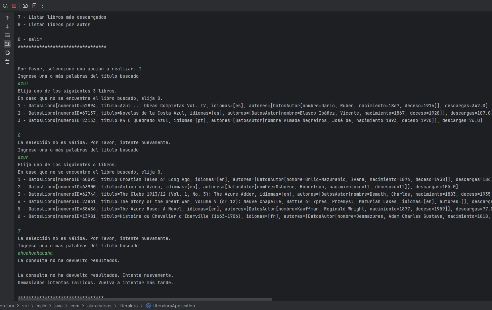
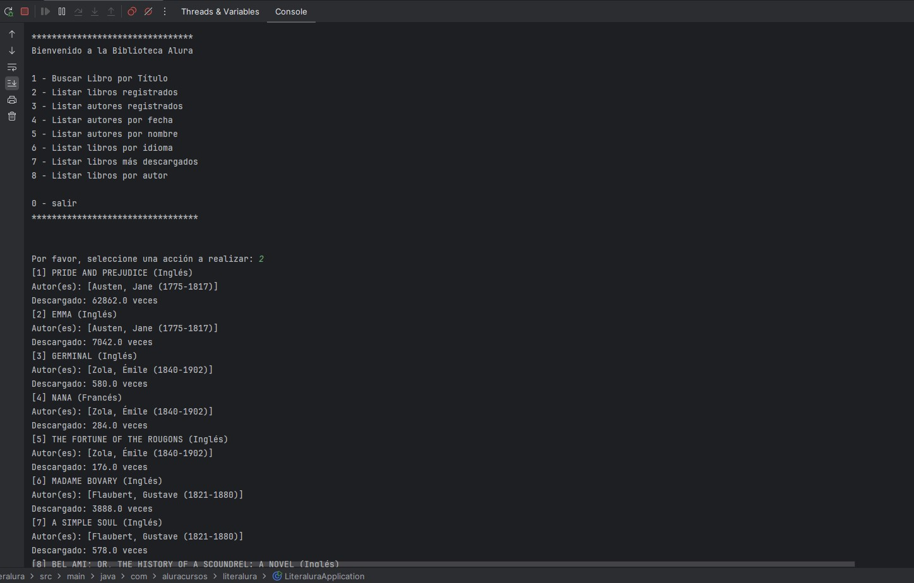
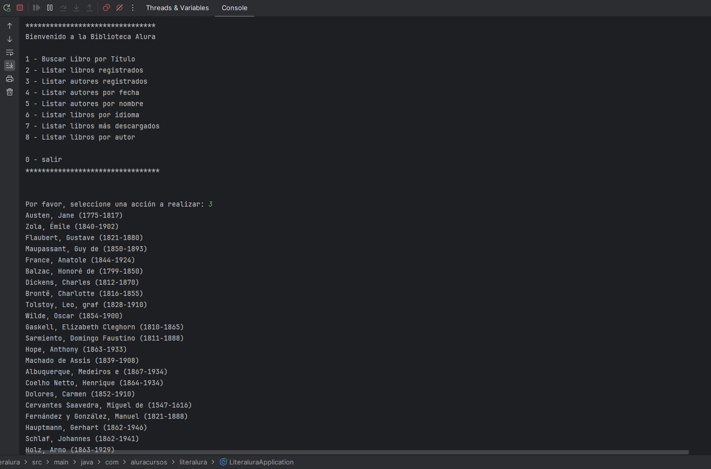
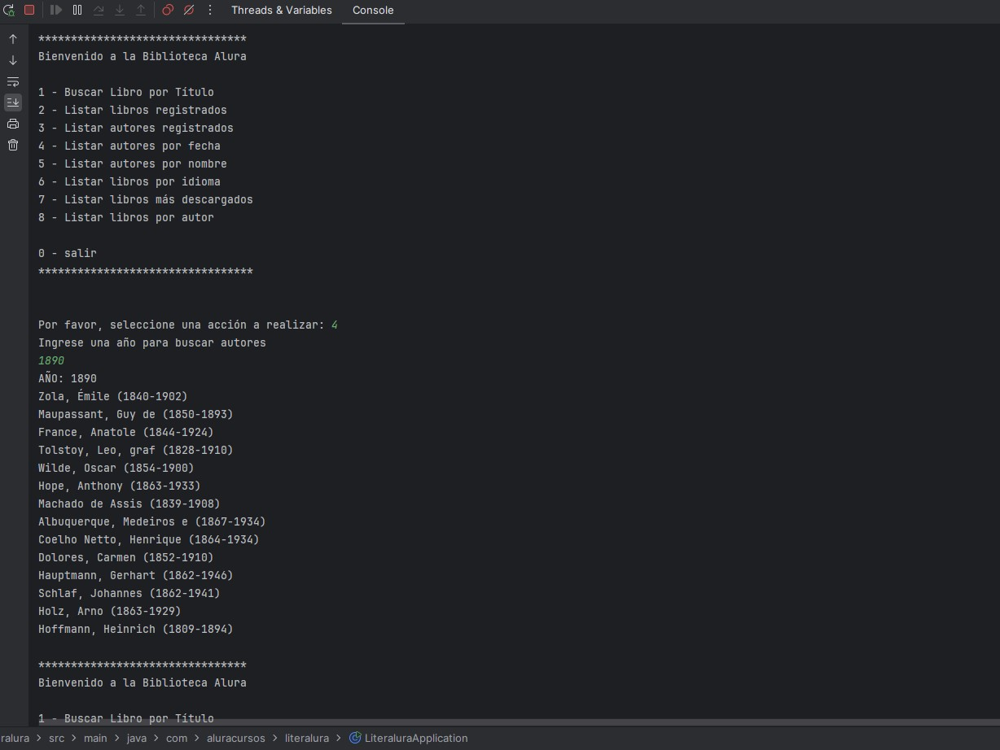
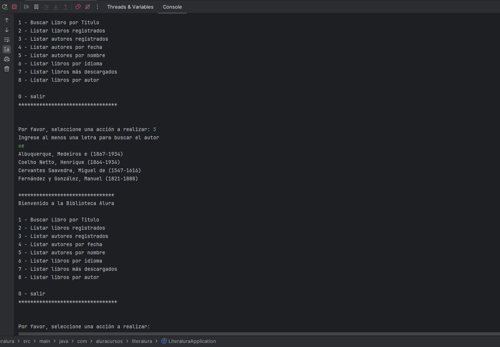

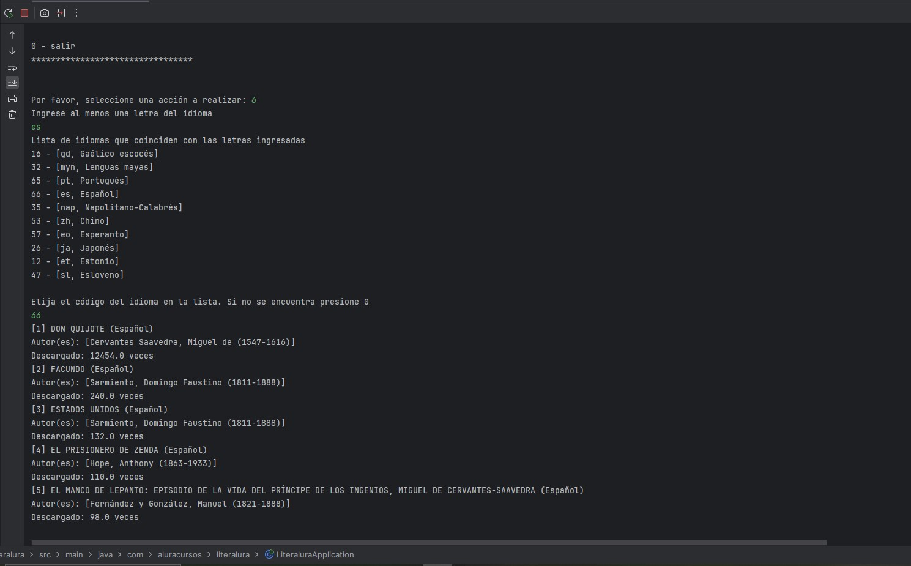
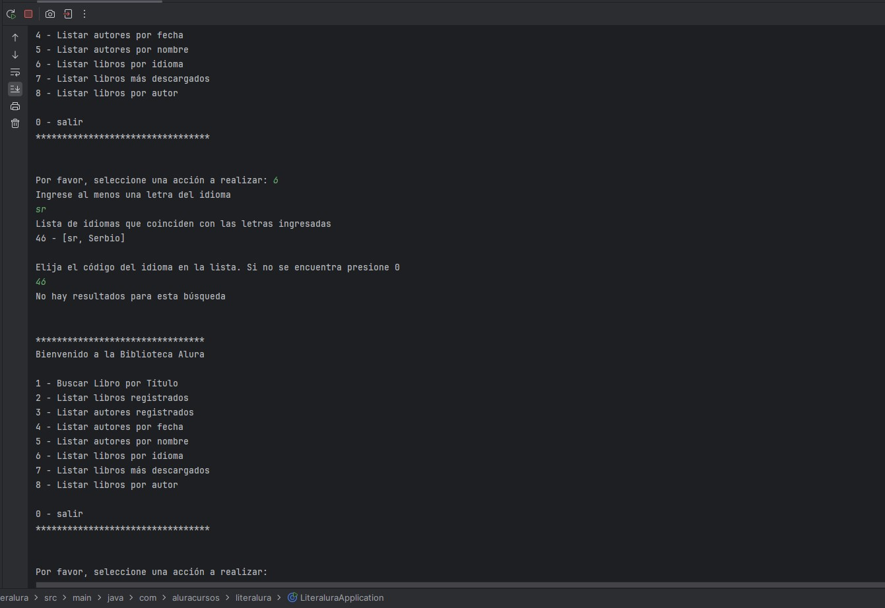
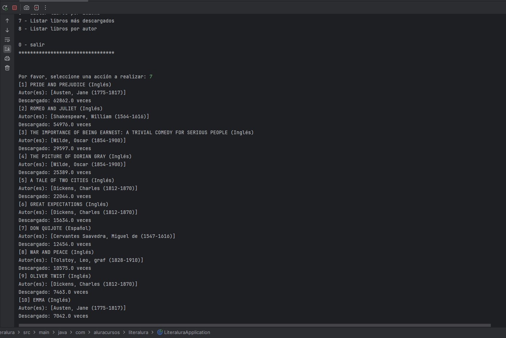
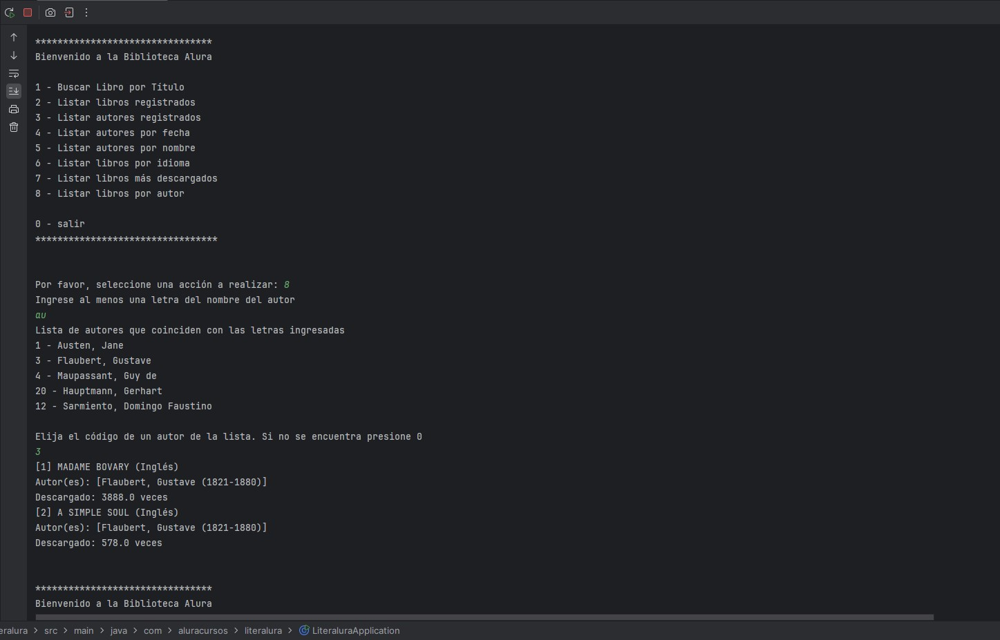

## Instrucciones de Uso
1. Clona este repositorio a tu pc.
2. Define tus variables de ambiente para DB_HOST, DB_USER, DB_NAME1, DB_PASSWORD (en Windows: SystemProperties/EnvironmentVariables) y reinicia la pc.
También puedes específicarlas manualmente en literalura/src/main/resources/aplication.properties.
3. Ejecuta la clase LiteraluraAplication
4. Elije una opción del menu y diviertete!

## Funcionalidades
- Consultas seguras: La aplicación no falla sin importar lo que busques.
- Almacenamiento de datos a elección: Vos elegís si un libro es importante o no.
- Interfaz de usuario intuitiva: el menú es amigable y fácil de usar.

### Clases Modelo
**Datos** mapea la respuesta JSON de una API, utilizando anotaciones de Jackson para deserializar una lista de objetos DatosLibro y un entero que representa la cantidad de registros. 
La anotación @JsonIgnoreProperties(ignoreUnknown = true) asegura que cualquier propiedad desconocida en el JSON será ignorada durante la deserialización.
**DatosLibro** es un registro que mapea la información de un libro desde el JSON Datos.resultados. 
Utiliza anotaciones de Jackson para deserializar campos como el ID, título, idiomas, autores y la cantidad de descargas. 
La anotación @JsonIgnoreProperties(ignoreUnknown = true) permite ignorar cualquier propiedad desconocida en el JSON durante la deserialización.
**Libro** representa una entidad JPA para la tabla libros y mapea sus campos a las columnas de la base de datos. 
Incluye relaciones con autores y propiedades como título, idioma y número de descargas. 
Además, proporciona un constructor específico que resuelve algunos conflictos de la base de la API web, permitiendo una forma segura de crear instancias a partir de un objeto DatosLibro.
**DatosAutor** registro que se utiliza para deserializar información de un autor desde un JSON, mapeando campos como el nombre, año de nacimiento y año de fallecimiento mediante las anotaciones de Jackson.
La anotación @JsonIgnoreProperties(ignoreUnknown = true) asegura que cualquier propiedad desconocida en el JSON será ignorada durante la deserialización.
**Autor** representa una entidad JPA para la tabla autores, mapeando los campos de nombre, fecha de nacimiento y fecha de fallecimiento. 
Además, proporciona un constructor que permite crear instancias a partir de un objeto DatosAutor, manejando casos especiales como autores anónimos y validando la consistencia de las fechas.

### Enumeraciones
**Idioma** define una serie de constantes para representar varios idiomas junto con sus siglas y nombres en inglés y español.
Proporciona métodos para obtener un Idioma a partir de una lista de siglas o del nombre en español del idioma.
Fue creada con ChatGPT en base a los datos informados en https://www.gutenberg.org/browse/languages/es.
Promt en ChatGPT: "Crear un Enum (JAVA)  Idioma con los siguientes idiomas: (Afrikaans  Aleut  Arabic  Arapaho  Bodo  Breton  Bulgarian  Caló  Catalan  Cebuano  Czech  Estonian  Farsi  Frisian  Friulian  Gaelic, Scottish  Galician  Gamilaraay  Greek, Ancient  Hebrew  Icelandic  Iloko  Interlingua  Inuktitut  Irish  Japanese  Kashubian  Khasi  Korean  Lithuanian  Maori  Mayan Languages  Middle English  Nahuatl  Napoletano-Calabrese  Navajo  North American Indian  Norwegian  Occitan  Ojibwa  Old English  Polish  Romanian  Russian  Sanskrit  Serbian  Slovenian  Tagabawa  Telugu  Tibetan  Welsh  Yiddish ,  Chinese  Danish  Dutch  English  Esperanto  Finnish  French  German  Greek  Hungarian  Italian  Latin  Portuguese  Spanish  Swedish  Tagalog) 
ordenarlos en orden alfabético. Atributos: sigla (de dos letras en inglés), idiomaEnIngles, idiomaEnEspañol".

### Clases de Servicio
**ConsumeApi** proporciona un método para realizar solicitudes HTTP GET a una URL dada, manejando posibles excepciones de conexión y devolviendo la respuesta en formato JSON como una cadena.
**ConvierteDatos**  implementa la interfaz IConvierteDatos y proporciona un método para convertir una cadena JSON en una instancia de una clase específica utilizando la biblioteca Jackson. 
Maneja las posibles excepciones de procesamiento de JSON y lanza una excepción en caso de error.
Interface **IConvierteDatos** define un método genérico para convertir una cadena JSON en una instancia de una clase especificada, proporcionando una abstracción para la deserialización de datos JSON.
**LibroService** proporciona métodos para buscar libros en una API externa, gestionar su persistencia en la base de datos. 
Realiza operaciones como obtener todos los libros, buscar libros por idioma, listar los libros más descargados, y filtrar libros por autor. 
Utiliza inyección de dependencias para acceder a los repositorios de libros y autores, así como otras clases de servicios para consumir la API y convertir datos.
**AutorService**  ofrece funcionalidades centradas en la gestión de autores en la base de datos. 
Sus métodos permiten recuperar todos los autores, listar aquellos que estuvieron vivos en un año específico y buscar autores por su nombre. 
Este servicio se apoya en la inyección de dependencias para acceder al repositorio de autores y utiliza un objeto Scanner para interactuar con la entrada del usuario.
**Controla** utiliza un componente de servicio de Spring para gestionar operaciones relacionadas con libros y autores, delegando la impresión de resultados a un objeto Imprime.
**Imprime** proporciona métodos para imprimir elementos en la consola, abordando diferentes tipos de objetos como libros, autores y mapas.

